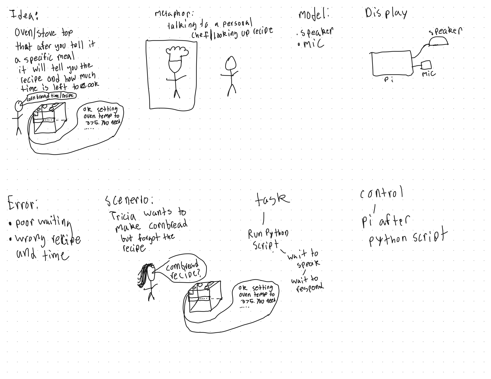

# Chatterboxesz

Abiola Boaji (ab3394)

[](https://youtu.be/LZ0VJClIlRI?si=Yy84mcyVYuVV19mn)

In this lab, we want you to design interaction with a speech-enabled device — something that listens and talks to you. This device can do anything *but* control lights (since we already did that in Lab 1). First, we want you to storyboard what you imagine the conversational interaction to be like. Then you will use wizarding techniques to elicit examples of what people might say, ask, or respond. We then want you to use the examples collected from at least two other people to inform the redesign of the device.

We will focus on **audio** as the main modality for interaction to start; these general techniques can be extended to **video**, **haptics** or other interactive mechanisms in the second part of the Lab.

A note on what you are building with. Speech interfaces are usually taught as two boxes — speech-in, speech-out — and that framing hides the part that actually determines whether an interaction works. Between listening and speaking sits the question of **whose turn it is**: when does the device decide you have finished talking, and how long does it make you wait before it answers? This lab gives you direct control over both, and we will ask you to notice what changes when you move them.

## Prep for Part 1: Get the Latest Content and Pick up Additional Parts

Please check instructions in [prep.md](prep.md) and complete the setup.

### Pick up Web Camera If You Don't Have One

Students who have not already received a web camera will receive their Webcam and at the beginning of lab. If you cannot make it to class this week, please contact the TAs to ensure you get these.

### Get the Latest Content

As always, pull updates from the class Interactive-Lab-Hub to both your Pi and your own GitHub repo.

**\[recommended\]** Option 1: On the Pi, `cd` to your `Interactive-Lab-Hub`, pull the updates from upstream (class lab-hub) and push the updates back to your own GitHub repo. You will need the *personal access token* for this.

```
pi@ixe00:~$ cd Interactive-Lab-Hub
pi@ixe00:~/Interactive-Lab-Hub $ git pull upstream Fall2026
pi@ixe00:~/Interactive-Lab-Hub $ git add .
pi@ixe00:~/Interactive-Lab-Hub $ git commit -m "get lab3 updates"
pi@ixe00:~/Interactive-Lab-Hub $ git push
```

Option 2: On your own GitHub repo, create a pull request to get updates from the class Interactive-Lab-Hub. After you have the latest updates online, go to your Pi, `cd` to your `Interactive-Lab-Hub` and use `git pull`.

---

# Part 1

## Setup

Create and activate a virtual environment for this lab:

```
pi@ixe00:~$ cd Interactive-Lab-Hub/Lab\ 3
pi@ixe00:~/Interactive-Lab-Hub/Lab 3 $ python3 -m venv .venv
pi@ixe00:~/Interactive-Lab-Hub/Lab 3 $ source .venv/bin/activate
(.venv) pi@ixe00:~/Interactive-Lab-Hub/Lab 3 $
```

Install the Python dependencies:

```
(.venv) $ pip install -r requirements.txt
```

This takes a few minutes. If you would like it to take considerably less time, [`uv`](https://docs.astral.sh/uv/) is a drop-in replacement for `pip` that is dramatically faster on the Pi:

```
(.venv) $ pip install uv && uv pip install -r requirements.txt
```

Then run the setup script, which installs the classic speech synthesizers, downloads the voice activity detection model, and pre-fetches a neural voice and a speech recognition model so you are not waiting on downloads during lab:

```
(.venv):~$ cd speech-scripts
(.venv) $ ./setup.sh
```

Check your audio devices before going further. `arecord -l` lists capture devices and `aplay -l` lists playback devices; if your webcam microphone or Bluetooth speaker does not appear, fix that first — every script below assumes the system defaults are the ones you want.

## A. Text to Speech

Your Pi can speak in several quite different ways, and the differences are audible in a way that matters for design. In `speech-scripts/` there are shell scripts for each.

### The classic engines

```
(.venv) $ cd speech-scripts

(.venv) $ sudo apt update
(.venv) $ sudo apt install -y espeak festival festvox-kallpc16k

(.venv) $ ./espeak_demo.sh
(.venv) $ ./festival_demo.sh
```

You can run these `.sh` files by typing `./filename`, and read one with `cat filename`. You can also play audio files directly with `aplay filename` — try `aplay lookdave.wav`.

These are all decades-old technology and they sound like it. `espeak-ng` is a *formant synthesizer*: it generates speech from an acoustic model of the vocal tract, which is why it sounds robotic but also why the whole thing fits in a couple of megabytes and responds instantly. `festival` is *concatenative*: they stitch together recorded fragments of a real speaker, which sounds more human but breaks audibly at the seams.

### Neural TTS with Piper

Note that the Piper command line changed in version 1.x — voices are now downloaded explicitly with `python3 -m piper.download_voices`, and you invoke it as `python3 -m piper`. Tutorials you find online may show the old `echo ... | piper --model ...` form, which no longer works. Browse the [voice samples](https://rhasspy.github.io/piper-samples) and download a different one if you'd like:

```
(.venv) $ python3 -m piper.download_voices en_US-lessac-medium
```

[Piper](https://github.com/OHF-Voice/piper1-gpl) synthesizes speech with a small neural network, runs comfortably on the Pi 5, and sounds markedly better than the above.

```
(.venv) $ ./piper_demo.sh
```

The demo script also shows `--output-raw`, which streams audio to the speaker as it is generated rather than writing a file first. Listen for the difference in how quickly speech begins. In a conversational system this gap is the thing your user experiences as responsiveness.

\*\***Write your own shell file to use your favorite of these TTS engines to have your Pi greet you by name.**\*\*

See speech-scripts/piper_greet.sh

\*\***Then answer: Is the same greeting, in these different voices, the same greeting? Describe one concrete way the voice changed what the utterance seemed to mean or who seemed to be speaking.**\*\*

The greetings are diffrent. The english American version uses a female voice that speaks faster and the Swahili voice uses a male voice that speaks slower.
## B. Speech to Text

We use [faster-whisper](https://github.com/SYSTRAN/faster-whisper), a reimplementation of OpenAI's Whisper model that runs several times faster on CPU and does not require PyTorch. All processing happens on the Pi; nothing is sent to a server.

```
(.venv) $ python transcribe.py lookdave.wav
```

The transcript is not the interesting output here — the timings are. Run it again with a larger model and compare:

```
(.venv) $ python transcribe.py lookdave.wav --model base.en
(.venv) $ python transcribe.py lookdave.wav --model small.en
#  noted that the first run may take longer because the model is downloaded, and that the HF unauthenticated-request warning is expected and not an error.
```

Available sizes, smallest first: `tiny.en`, `base.en`, `small.en`, `medium.en`. The `.en` variants are English-only and faster than their multilingual counterparts at the same size.

\*\***Record a few seconds of your own speech (`arecord -d 5 -f cd -c 1 -r 16000 test.wav`) and transcribe it with at least two model sizes. Report the real-time factor for each. At what point does the accuracy improvement stop being worth the delay, for a system that has to answer you?**\*\*

Base: 0.43x
Medium: 2.84x

I would say the point depends on what was being recorded. For example, I simply read the alphabet so nothing that required a lot of processing as the base was able to do it the same as the medium at nearly 7 times faster.

\*\***Write your own script that verbally asks for a numerical input (a phone number, zipcode, number of pets) and records the answer the respondent provides.**\*\* Numbers are a good stress test — transcription systems make characteristic errors on digit strings, and you will want to know what they are before you design around them.

## C. Turn-taking: knowing when someone has stopped talking

Everything so far has worked on fixed audio files. A real conversational device does not get told when to start and stop recording — it has to decide. This is the problem that makes speech interfaces hard, and it is mostly not a speech recognition problem.

We use a **voice activity detector** (VAD) to segment the microphone stream into utterances. `listen.py` runs Silero VAD continuously and hands each detected utterance to faster-whisper:

```
(.venv) $ cd speech-scripts
(.venv) $ python listen.py
```

Speak, pause, and watch it transcribe. Now change the endpointing threshold — the amount of silence the system requires before it decides your turn is over:

```
(.venv) $ python listen.py --min-silence 0.2
(.venv) $ python listen.py --min-silence 1.5
```

\*\***Try both extremes, and something in between. Describe what each one feels like to talk to. Note specifically: at 0.2s, what kinds of normal speech get cut off? At 1.5s, what does the delay make the system seem like?**\*\*

Talking to the 0.2 felt like talking to someone who does not actually listens to you but hears because it transcribes very fast. Normal speech that is also very fast gets cut off. The delay at 1.5 however seems more normal or at least does not seem as hard to understand. It does however make it difficult to wait for it to process.

There is no correct value. A system that takes drink orders and a system that listens to someone think out loud want very different thresholds, and the right one depends on what your users are doing with their pauses.

### The complete loop

`echo_bot.py` puts the pieces together: it listens, endpoints, transcribes, and speaks a reply through Piper. The dialogue policy is deliberately trivial — it repeats what you said — so that everything you notice is a property of the timing rather than the content.

```
(.venv) $ python echo_bot.py
```

## D. Storyboard

Storyboard and/or use a Verplank diagram to design a speech-enabled device. (Stuck? Make a device that talks for dogs. If that is too stupid, find an application that is better than that.)

\*\***Post your storyboard and diagram here.**\*\*
### Storyboard


### Diagram



Write out what you imagine the dialogue to be. Use cards, post-its, or whatever method helps you develop alternatives or group responses.

\*\***Please describe and document your process.**\*\*

Reference scenario: [Cornbread Script.pdf](Cornbread%20Script.pdf).


## E. Acting out the dialogue

Find a partner, and *without sharing the script with your partner* try out the dialogue you've designed, where you (as the device designer) act as the device you are designing. Please record this interaction (for example, using Zoom's record feature).


The dialog seemed similar to how I imagined it in my head before being acted out. I would say it was difficult for me to be the device and know if I should wait to hear longer strings of words vs respond quicker because the user did not use as much words. The link to the recordings is here (https://drive.google.com/drive/folders/1i-nW80Kwo5QQnPVkidskgqXqI4jXtov1?usp=drive_link)

Feedback:
The interactive oven idea is super unique and fun! In addition to listing ingredients and checking how much time is left, I think it'd be cool to add a temperature check feature or commands like preheat, light on/off, etc.

---

# Lab 3 Part 2

For Part 2, you will redesign the interaction with the speech-enabled device using the data collected, as well as feedback from part 1.

## Prep for Part 2

1. What are concrete things that could use improvement in the design of your device? For example: wording, timing, anticipation of misunderstandings.

I think the oven does a good job at being able to detect key words but overall human interaction in terms of treating
the device like we would siri or alexa was not the same. I.e. when I tried to thank the oven or just start off with hello it would not respond.

2. What are other modes of interaction *beyond speech* that you might also use to clarify how to interact? In particular: how does someone know when the device is listening, and when it is thinking? You have a screen and an LED.

3. Make a new storyboard, diagram and/or script based on these reflections.
4. (optional) Integrate [input devices](inputs.md) in the system

## Prototype your system

The system should:
* use the Raspberry Pi
* use one or more sensors
* require participants to speak to it

*Document how the system works.*

### How the oven prototype works

The prototype runs on the Raspberry Pi and uses a microphone as its sound sensor. A participant must speak to interact with it; the Pi's speaker plays the oven's responses. The dialogue is based on the [Cornbread Script](Cornbread%20Script.pdf) and implemented in [oven_bot.py](speech-scripts/oven_bot.py).

1. From the Lab 3 directory, activate the virtual environment and install dependencies with `pip install -r requirements.txt`. Connect the ST7789 PiTFT display, then start the program with `python speech-scripts/oven_bot.py`. It loads the microphone, voice-activity detector (VAD), speech recognizer, Piper voice, and display, then speaks a greeting. Use `--no-screen` to run audio-only.
2. The microphone captures audio while the oven is listening. The VAD detects when speech ends (after 0.6 seconds of silence by default), and faster-whisper turns that audio into text.
3. The dialogue logic matches the recognized request and chooses a response. For example, the user can ask for the saved recipe list, request the cornbread ingredients, start a timer, ask how much time remains, or cancel the timer. Other saved recipes are currently names only; cornbread is the only one with ingredient and timing notes.
4. Piper reads the response aloud. The microphone is paused during playback and the VAD is reset before listening resumes, to reduce the chance of the oven transcribing its own voice. The dialogue and recognized speech are also printed in the terminal.
5. The timer uses the Pi's software clock. Saying that the cornbread has been put in the oven starts its saved 20-minute timer; a custom duration can also be requested. During the countdown, the PiTFT shows an oven-window scene, a numeric time-remaining display, and a stylized cornbread loaf. As the timer counts down, the illustrated loaf grows taller and wider and its color darkens to suggest baking. At zero, the illustration reaches its finished size, the screen reminds the user to check the food, and the oven announces that the timer has finished. The animation is generated from elapsed timer progress; it is illustrative only and does not use a camera or sensor to observe the food.

This is a speech-interaction prototype, not a connected oven: it cannot set or measure oven temperature, detect whether food is inside, or control heating. The cornbread note does not specify a temperature, so follow the recipe/package directions and check doneness directly. Timer state is temporary and the conversation is not automatically saved to a log file.

*Include videos or screencaptures of both the system and the controller.*

## Test the system

Try to get at least two people to interact with your system. (Ideally, you would inform them that there is a wizard *after* the interaction, but we recognize that can be hard.)

Answer the following:

### What worked well about the system and what didn't?
The Raspberry Pi can support the full speech interaction: it listens through the microphone, transcribes a request, and speaks a response. The recipe-list and cornbread examples give the interaction a clear purpose, and a software timer lets the user ask how much cooking time remains without needing to touch a control. In an early run, the oven sometimes repeated its own response before I spoke, and the speech felt too fast. I updated the program to pause microphone capture while Piper speaks and slowed the voice. This should reduce self-transcription, but I still need to test the change with users. The prototype also only has detailed information for cornbread; it cannot control or sense a real oven, and the other saved recipes are names only.

### What worked well about the controller and what didn't?
When I acted as the oven in the Wizard-of-Oz interaction, I could understand varied requests and choose a useful response more flexibly than the current keyword-based program. However, it was difficult to decide how long to wait: some users said very little, while others needed more time to finish a thought. The software controller is consistent and prints both the recognized speech and its response, which helps with debugging, but it only recognizes a limited set of phrases. A different wording or a transcription error can lead to an irrelevant response; it also cannot verify the oven temperature or whether food was actually placed inside.

### What lessons can you take away from the WoZ interactions for designing a more autonomous version of the system?
The interaction should make turn-taking clear and allow enough silence for a person to finish speaking. The system should give a short listening or thinking cue, avoid listening to its own spoken output, and confirm important details such as the recipe and timer duration before acting. The WoZ experience also showed that people may phrase the same request in different ways, so the autonomous version should handle alternate wording and ask a clarifying question when it is unsure. Future temperature or oven-state features would need real sensors; the current timer alone cannot confirm that food is cooking safely or is done.

### How could you use your system to create a dataset of interaction? What other sensing modalities would make sense to capture?
With participants' informed consent, I could save each interaction as a timestamped record containing the recognized transcript, the system response, the detected intent, timer state, and whether the user had to repeat or correct a request. Short audio recordings could help identify speech-recognition errors, but should be stored securely, anonymized where possible, and deleted when no longer needed. A temperature probe and an oven-door sensor could add context about the cooking state; a screen or LED could record or show whether the system is listening, processing, or speaking. Any camera use would need a clear purpose and additional privacy safeguards. I should test with at least two people and add their actual observations before drawing conclusions about how well the system works.

<details>
  <summary><strong>Submission Cleanup Reminder (Click to Expand)</strong></summary>

  **Before submitting your README.md:**
  - This readme.md file has a lot of extra text for guidance.
  - Remove all instructional text and example prompts from this file.
  - You may either delete these sections or use the toggle/hide feature in VS Code to collapse them for a cleaner look.
  - Your final submission should be neat, focused on your own work, and easy to read for grading.
</details>
